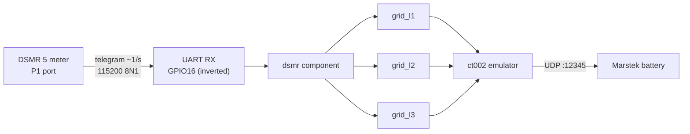
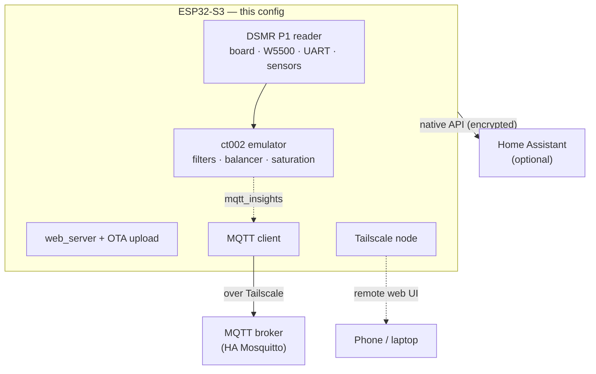
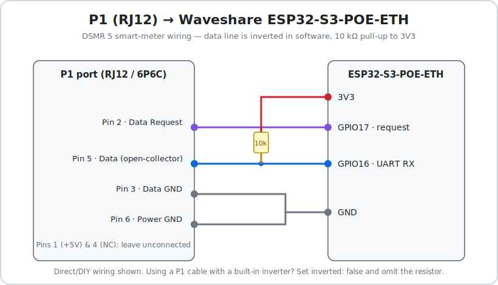
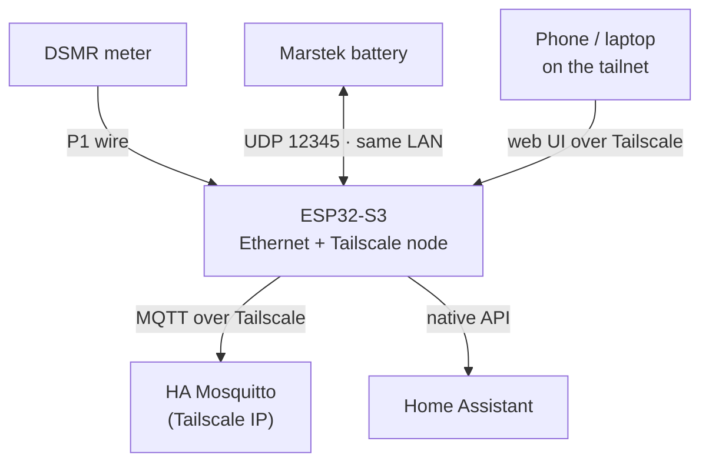

# ESPHome — DSMR P1 → AstraMeter CT002 (Marstek)


-0969da)

An ESPHome config that reads a Dutch **DSMR 5 (P1)** smart meter and feeds the signed
per-phase grid power into the **[AstraMeter](https://github.com/tomquist/astrameter)
`ct002` component**, emulating a **Marstek CT002** grid sensor. Marstek storage
batteries then steer toward zero grid (self-consumption / zero-export) — no Marstek
cloud, no CT clamp, no extra dongle. Runs on a **Waveshare ESP32-S3-POE-ETH** over wired
PoE Ethernet, and is reachable anywhere via **Tailscale**.

## Contents

- [How it works](#how-it-works)
- [Architecture](#architecture)
- [Hardware](#hardware)
- [Wiring](#wiring)
- [GPIO usage](#gpio-usage)
- [Network & remote access](#network--remote-access)
- [Repository layout](#repository-layout)
- [Installation](#installation)
- [Configuration](#configuration)
- [Entities](#entities)
- [Upgrading](#upgrading)
- [Performance & resource usage](#performance--resource-usage)
- [Troubleshooting](#troubleshooting)
- [Credits](#credits)

## How it works



Each phase is computed as `(power_delivered − power_returned) × 1000`, in **watts**:

- **positive** = consumption / grid **import**
- **negative** = production / grid **export**

This is exactly the sign convention the `ct002` component expects. Values refresh on every
telegram (~1× per second on SMR5); the emulator reads the latest value on each Marstek
battery UDP poll.

## Architecture



Everything is in **one self-contained file** (`astrameter-ct002-dsmr.yaml`) — copy
`secrets.yaml` and flash, no extra includes to manage. The device runs **fully standalone**:
Home Assistant is optional, and `reboot_timeout: 0s` on both `api:` and `mqtt:` keeps it
alive even if HA or the broker is unreachable.

### Two ways to flash: single-file (V1) or split (V2)

Both build **identical firmware** — pick whichever layout you prefer:

- **V1 — [`astrameter-ct002-dsmr.yaml`](astrameter-ct002-dsmr.yaml):** everything in one
  self-contained file. Edit anything locally, no GitHub round-trip.
- **V2 — [`astrameter-ct002-dsmr.v2.yaml`](astrameter-ct002-dsmr.v2.yaml):** a thin
  per-device entrypoint that holds only the settable **substitutions** and pulls the bulk
  from this repo as an ESPHome **package**
  ([`packages/astrameter-ct002-dsmr.base.yaml`](packages/astrameter-ct002-dsmr.base.yaml))
  at a pinned `ref:`. Secrets still resolve from your **local** `secrets.yaml`; the hosted
  base contains none.

Choose V2 if you run several devices off a shared base, or want bulk changes to land via
git; choose V1 for a single self-contained file.

## Hardware

| Spec | Value |
|------|-------|
| Board | Waveshare **ESP32-S3-POE-ETH** |
| Module | ESP32-S3-WROOM-1(U)-**N16R8** |
| MCU | ESP32-S3, Xtensa LX7 dual-core @ 240 MHz |
| Flash | 16 MB |
| PSRAM | 8 MB **octal** (mandatory for the Tailscale component) |
| Ethernet | **W5500** over SPI, 10/100 Mbps, **PoE** |
| Power | PoE (802.3af) or USB-C |

## Wiring

Only the **P1 port** needs wiring — Ethernet and power are on-board (PoE/USB-C).



The P1 port is an **RJ12 (6P6C)** socket. Connect 4 of its 6 wires:

| P1 pin | Signal | → board | Notes |
|--------|--------|---------|-------|
| 2 | Data Request (RTS) | **GPIO17** | driven HIGH by ESPHome to request telegrams |
| 3 | Data GND | **GND** | ground for the data signal |
| 5 | Data (RxD) | **GPIO16** | **add a 10 kΩ pull-up to 3V3** |
| 6 | Power GND | **GND** | |
| 1, 4 | +5V / NC | — | leave unconnected |

**Why the pull-up + inversion:** the P1 data line is open-collector and logically inverted.
The 10 kΩ pull-up to 3V3 sets the idle level, and `inverted: true` on the UART RX pin flips
it back in software. If you use a **ready-made P1 cable with a built-in inverter**, set
`inverted: false` in the `uart:` block and omit the external resistor.

The P1 pins (`dsmr_rx_pin`, `dsmr_request_pin`, `dsmr_baud_rate`) are substitutions at the
top of the config — change them if your wiring differs.

## GPIO usage

| GPIO | Function |
|------|----------|
| 9 | W5500 reset |
| 10 | W5500 interrupt |
| 11 | W5500 MOSI |
| 12 | W5500 MISO |
| 13 | W5500 SCLK |
| 14 | W5500 CS |
| 16 | P1 UART RX (inverted) |
| 17 | P1 data request (RTS) |
| 33–37 | Octal PSRAM (reserved — do not use) |
| 43 / 44 | USB-serial console (logger) |

## Network & remote access



The device joins your **tailnet as a real node** (via
[esphome-tailscale](https://github.com/Csontikka/esphome-tailscale)), so the web UI is
reachable from anywhere with no port-forwarding, at the node's `100.x.y.z` address or its
MagicDNS name. The MQTT connection to Home Assistant's broker also rides the tunnel — see
[Upgrading the Tailscale component](#upgrading-the-tailscale-component) for the caveats.

## Repository layout

| File | Purpose |
|------|---------|
| [`astrameter-ct002-dsmr.yaml`](astrameter-ct002-dsmr.yaml) | **V1 (single-file)** — the entire device, self-contained: board, Ethernet, P1/DSMR reader, meter sensors, CT002 emulator, web UI, Tailscale, MQTT |
| [`astrameter-ct002-dsmr.v2.yaml`](astrameter-ct002-dsmr.v2.yaml) | **V2 entrypoint** — thin per-device file: just the settable substitutions + a `packages:` link to the base below |
| [`packages/astrameter-ct002-dsmr.base.yaml`](packages/astrameter-ct002-dsmr.base.yaml) | **V2 base package** — the bulk (everything in V1 except substitutions), consumed remotely; holds no secrets |
| [`astrameter-ct002-dsmr.simple.yaml`](astrameter-ct002-dsmr.simple.yaml) | **Simple** — minimal standalone build: DSMR → CT002 over Ethernet, with API + OTA. No Tailscale/VPN, web server or MQTT; ct002 on built-in defaults |
| [`secrets.yaml.example`](secrets.yaml.example) | Template for `secrets.yaml` (which is gitignored) |
| [`docs/wiring.svg`](docs/wiring.svg) | P1 wiring diagram |

## Installation

```bash
git clone https://github.com/Maart3nL/esphome-astrameter-dsmr.git
cd esphome-astrameter-dsmr
cp secrets.yaml.example secrets.yaml      # then fill in the values
esphome run astrameter-ct002-dsmr.yaml    # first flash over USB; later flashes via OTA/web UI
# …or the split layout (bulk fetched from GitHub — see "Two ways to flash"):
# esphome run astrameter-ct002-dsmr.v2.yaml
```

Fill in `secrets.yaml`:

| Secret | How to get it |
|--------|---------------|
| `web_username` / `web_password` | choose — gates the web UI **and** OTA upload (reachable over Tailscale, so make it strong) |
| `api_encryption_key` | `openssl rand -base64 32` |
| `ota_password` | `openssl rand -hex 16` |
| `mqtt_broker` | your HA host's Tailscale IP (most reliable) or MagicDNS name |
| `mqtt_username` / `mqtt_password` | your broker credentials |
| `tailscale_auth_key` | Tailscale admin → Settings → Keys → *Generate auth key* (reusable + ephemeral) |

After Tailscale first connects, open the device in the Tailscale admin console and
**Disable key expiry**, or the node drops off the tailnet after ~180 days.

## Configuration

- **ct002 tuning** — every filter / balancer / saturation knob is a substitution at the top
  of `astrameter-ct002-dsmr.yaml`, set to values that reproduce the component defaults.
  These are **compile-time**: edit one and re-flash. They can't be live-adjusted from HA
  because the component bakes them in at build time.
- **Secrets** — anything environment-specific (broker, credentials, keys, optional static
  IP) lives in `secrets.yaml` and is referenced via `!secret`, so nothing identifying is in
  this public repo.
- **Standalone** — keep or delete the `api:` block depending on whether you use Home
  Assistant. Either way the emulator and web UI work without it.

## Entities

All non-internal entities appear automatically in the web UI and (via the API) in Home
Assistant:

- **Meter:** `Grid Power L1/L2/L3` + `Grid Power Total` (W).
- **CT002 runtime:** `CT002 Active Control`, `Batteries Connected`,
  `CT002 Grid Input L1/L2/L3` (post-filter), `CT002 Type`, `CT002 MAC`.
- **CT002 settings:** every configured tuning value as a read-only `Setting · …` entity
  (marked diagnostic so HA tucks them away).
- **Controls:** `CT002 Debug Log` switch — turns ct002/AstraMeter `DEBUG` logging on/off
  at runtime (off by default; the global logger ceiling is `DEBUG` so the switch can
  raise it, but every tag stays at `INFO` until you flip it). `VPN Disable (stop
  auto-connect)` button — turns the Tailscale "VPN Enabled" switch off (persisted), so
  the VPN stays down across reboots until you switch it back on.
- **Tailscale:** `VPN Connected`, `VPN IP`, `VPN Peers`, `Device Memory`, a `Reboot`
  button, and more (provided by the Tailscale package).

## Upgrading

> General rule: bump the version, **validate, then compile** before flashing, and keep the
> old version handy to roll back. Keep ESPHome itself current too —
> `pip install -U esphome` (or update the add-on/Docker image) — since newer component
> features can require a newer ESPHome.

### Upgrading AstraMeter (the ct002 component)

The version is a single substitution:

```yaml
substitutions:
  astrameter_version: "2.1.2"      # ← bump this one line

external_components:
  - source: github://tomquist/astrameter@${astrameter_version}
    components: [ct002]
```

1. **Check for a release:** <https://github.com/tomquist/astrameter/releases>
   (or `git ls-remote --tags https://github.com/tomquist/astrameter.git`).
2. **Read the [CHANGELOG](https://github.com/tomquist/astrameter/blob/main/CHANGELOG.md)**
   between your version and the target — especially any `### Breaking` section and anything
   mentioning **ESPHome / `ct002` / a renamed key**. The ct002 ESPHome component is still
   flagged *experimental*, so its YAML schema can change between releases.
3. **Bump** `astrameter_version` to the new tag.
4. **Validate** (no flashing): `esphome config astrameter-ct002-dsmr.yaml` — catches
   renamed/removed config keys.
5. **Compile:** `esphome compile astrameter-ct002-dsmr.yaml`. This step matters: the
   `CT002 …` runtime/settings entities call the component's internal C++ API
   (`active_control()`, `connected_slave_count()`, `latest_grid_power()`, `ct_type()`,
   `ct_mac()`). If an accessor was renamed, the build fails **here**, not at config.
6. **Flash:** `esphome run astrameter-ct002-dsmr.yaml`.
7. **Roll back** anytime by setting `astrameter_version` back to the old tag and re-flashing
   — pinned tags make every build reproducible.

### Upgrading the Tailscale component

```yaml
packages:
  tailscale:
    url: https://github.com/Csontikka/esphome-tailscale
    ref: f70c903d88e6b156770cbcb363f3ea5890a033c2   # ← pinned, verified commit
    files: [packages/tailscale/tailscale.yaml]
    refresh: 1d
```

> **Why it's pinned:** the alternative — `ref: main` + `refresh: 0s` — makes ESPHome
> **re-fetch the latest `main` on every build**. You'd get updates automatically, but
> unpredictably: a rebuild months from now could pull a breaking change into a native-C++
> component without you choosing to. So `ref:` is pinned to the commit this repo was last
> verified against (`f70c903…`); update it deliberately when you want a newer version.

To update the pin deliberately:

1. **Find the current commit:** `git ls-remote https://github.com/Csontikka/esphome-tailscale main`
   (or browse the repo's commit history / releases).
2. **Set `ref:`** to that commit SHA (or a release tag, if the project starts tagging).
3. **Force a clean rebuild:** `esphome clean astrameter-ct002-dsmr.yaml` then
   `esphome compile astrameter-ct002-dsmr.yaml`. The component is native C++, so a **compile**
   is the real test — `esphome config` alone won't catch C++ changes.
4. **Flash, then verify on-device:** the `VPN Connected` sensor turns on and `VPN IP`
   populates. Re-confirm **Disable key expiry** is still set for the node in the Tailscale
   admin console, and glance at the `Device Memory` sensor.
5. **Roll back** by setting `ref:` to the previous commit and rebuilding.

> Caveats: the component is third-party and experimental, sets global lwIP `sdkconfig`
> options (shared with the W5500 driver), requires octal PSRAM, and caps tunnel throughput
> at ~2–5 Mbit/s.

### Upgrading ESPHome itself

```bash
pip install -U esphome      # or update the Home Assistant add-on / Docker image
esphome config astrameter-ct002-dsmr.yaml   # re-validate to surface new deprecations
```

Do this **before** a big component bump. It also surfaces deprecations early — e.g. a `/` in
an entity name (auto-fixed today) becomes a hard error in ESPHome 2026.7.0.

## Performance & resource usage

Measured from a full `esphome compile` (ESPHome 2026.5.x, ESP-IDF 5.5.4):

| Resource | Usage |
|----------|-------|
| Flash (app image) | ~1.15 MB of an ~8 MB app partition (**14%**) — auto-sized for 16 MB flash |
| Static RAM | ~52 KB of 320 KB internal DRAM (**16%**) + 8 MB PSRAM mostly free |
| lwIP sockets | `CONFIG_LWIP_MAX_SOCKETS` raised to **24** for ct002's UDP responder + Tailscale headroom |

**CPU:** light at idle/telemetry (one telegram/sec, a few ct002 polls/sec). The real ceiling
is **WireGuard crypto** — software ChaCha20 on the S3, which is why the tunnel caps at
~2–5 Mbit/s. Expect low single-digit % at idle, brief spikes during active remote (Tailscale)
use, OTA, or live web-UI streaming. If a future build runs tight, set `web_server: local:
false` to load the UI assets from a CDN instead of embedding them.

## Troubleshooting

| Symptom | Check |
|---------|-------|
| No telegrams parsed | `inverted: true` set, 10 kΩ pull-up present, wire on GPIO16, baud 115200 |
| ct002 not detected by battery | device + battery on the same subnet; UDP 12345 open; battery in **Self-Adaptation** mode |
| MQTT won't connect | broker reachable on the tailnet, secrets filled; a few failed attempts at boot are normal until the tunnel + time sync come up |
| Tailscale won't connect | auth key valid, key-expiry disabled, PSRAM present, device has internet for the control plane |
| Build too large / low heap | `web_server: local: false`; watch the `Device Memory` sensor |

## Credits

- [**AstraMeter**](https://github.com/tomquist/astrameter) by Tom Quist — the `ct002`
  emulator and ESPHome component.
- [**esphome-tailscale**](https://github.com/Csontikka/esphome-tailscale) by Csontikka —
  Tailscale on the ESP32 (built on [MicroLink](https://github.com/CamM2325/microlink)).
- [**ESPHome**](https://esphome.io) and its built-in `dsmr`, `ethernet`, `web_server`, and
  `mqtt` components.

Personal configuration repo — no license is set. If you want others to reuse it, add a
`LICENSE` (and mind the upstream components' own licenses).
